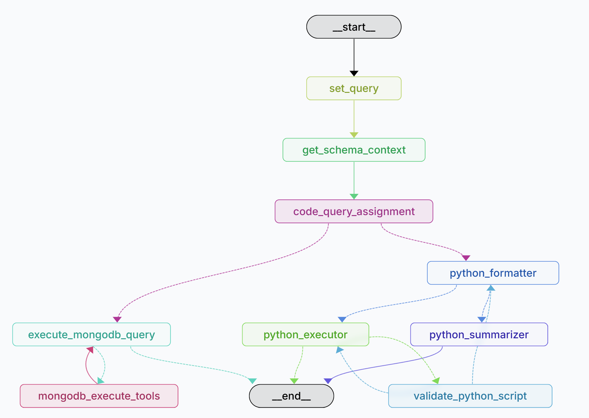

# GAMER: Generative Analysis for Metadata Retrieval

[](LICENSE)

[](https://github.com/semantic-release/semantic-release)


## Installation

Install a virtual environment with python 3.11 (install a version of python 3.11 that's compatible with your operating system).

```bash
py -3.11 -m venv .venv
```

On Windows, activate the environment with

```bash
.venv\Scripts\Activate.ps1
```

You will need access to the AWS Bedrock service in order to access the model. Once you've configured the AWS CLI, and granted access to Anthropic's Claude Sonnet 3 and 3.5, proceed to the following steps.

## Setup

The following keys need to be in your .env file -

```bash
# Only necessary if you want to trace conversations on Langsmith
LANGSMITH_API_KEY=<LANGSMITH_API_KEY>
LANGSMITH_TRACING=true

AWS_DEFAULT_REGION = us-west-2
```

## Accessing langgraph interface locally

Follow the installation instructions in [this webpage](https://langchain-ai.github.io/langgraph/tutorials/langgraph-platform/local-server/#next-steps)

```bash
langgraph dev
```

## Accessing the chainlit app

```bash
chainlit run src/gamer_x_interface/app.py
```

## Relevant repositories

[AIND Metadata MCP](https://github.com/AllenNeuralDynamics/aind-metadata-mcp)
[Vector embeddings generation script for metadata assets](https://github.com/AllenNeuralDynamics/aind-metadata-embeddings)
[Vector embeddings generation script for AIND data schema repository](https://github.com/AllenNeuralDynamics/aind_data_schema_embeddings)
[Streamlit app respository](https://github.com/sreyakumar/aind-GAMER-app)

## High Level Overview

The project's main goal is to developing a chat bot that is able to ingest, analyze and query metadata. Metadata is accumulated in lieu with experiments and consists of information about the data description, subject, equipment and session. To maintain reproducibility standards, it is important for metadata to be documented well. GAMER is designed to streamline the querying process for neuroscientists and other users.

## Model Overview



The current chat bot model uses Anthropic's Claude Sonnet 4, hosted on AWS' Bedrock service. Since the primary goal is to use natural language to query the database, the user will provide queries about the metadata specifically. The framework is hosted on Langchain. Claude's system prompt has been configured to understand the metadata schema format and craft MongoDB queries based on the prompt. Given a natural language query about the metadata, the model will produce a MongoDB query, thought reasoning and answer. This method of answering follows chain of thought reasoning, where a complex task is broken up into manageable chunks, allowing logical thinking through of a problem.

The main framework used by the model is Retrieval Augmented Generation (RAG), a process in which the model consults an external database to generate information for the user's query. This process doesn't interfere with the model's training process, but rather allows the model to successfully query unseen data with few shot learning (examples of queries and answers) and tools (e.g. API access) to examine these databases.

### Multi-Agent graph framework

A multi-agent workflow is created using Langgraph, allowing for parallel execution of tasks, like document retrieval from the vector index, and increased developer control.

This model uses a multi agent framework on Langraph to retrieve and summarize metadata information based on a user's natural language query. This workflow consists of 6 agents, or nodes, where a decision is made and there is new context provided to either the model or the user. Here are some decisions incorporated into the framework:

1. To best answer the query, should python code be executed, or should the data be accessed directly with the AIND data access API?
   - Input: `x (query), y (context about the data schema)`
   - Output: `mongodb, python`
2. Does the python script need to be executed?
   - Input: `x (query)`
   - Output: `yes, no`
3.  Does the python script/ MongoDB query need to be restructured?
   - Input: `x (query), y (tool output)`
   - Output: `yes, no`

## Data Retrieval

### AIND-data-access REST API

For queries that require accessing the entire database, like count based questions, information is accessed through an aggregation pipeline, provided by one of the constructed LLM agents, and the API connection.
